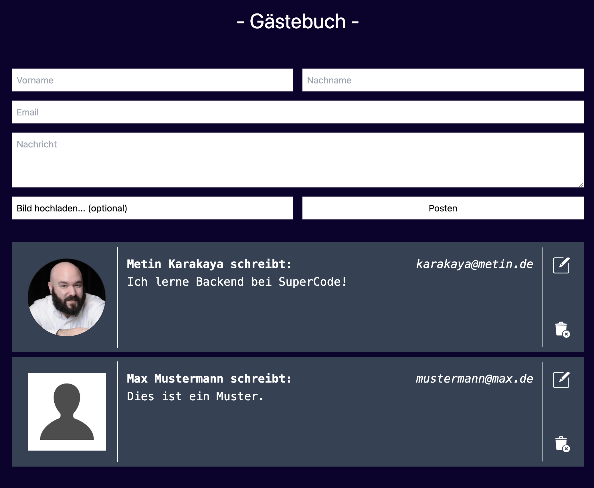
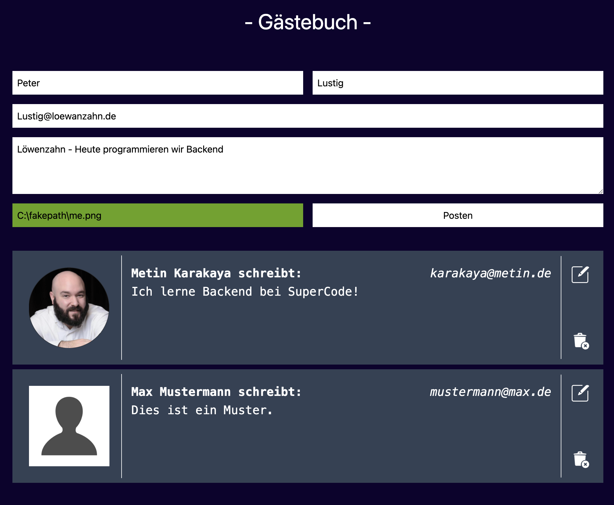
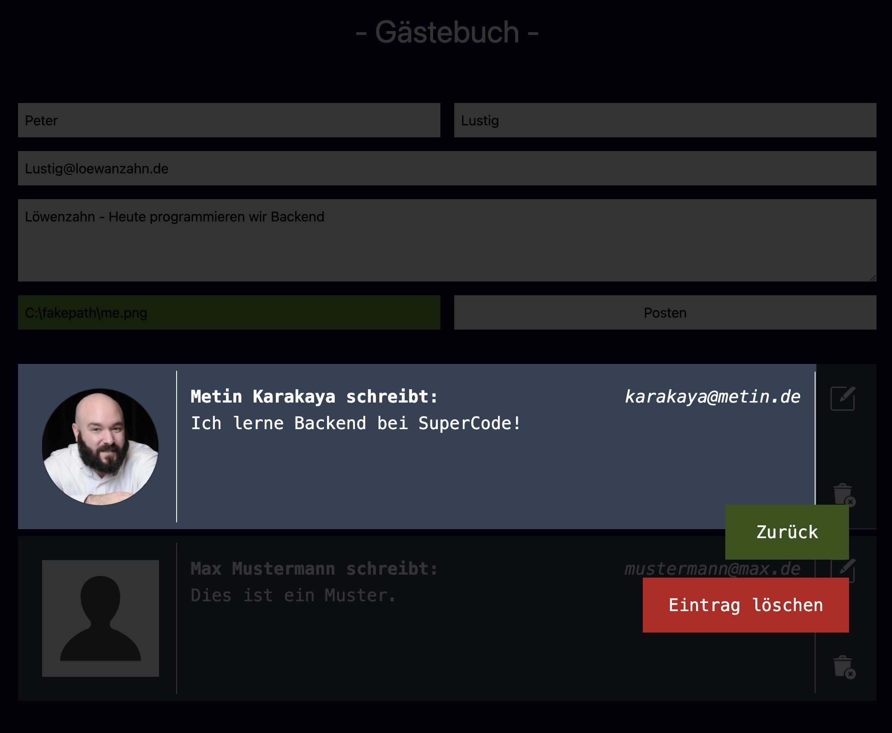
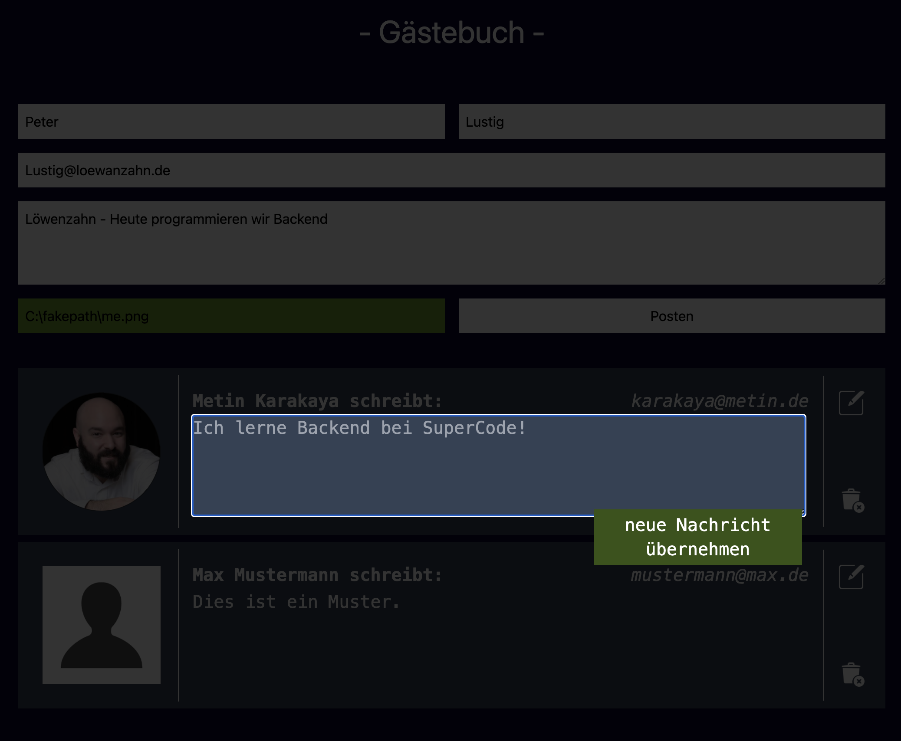

# Gästebuch mit Frontend und Backend

Aus einer simplen kleinen Übung für Backend Routing habe ich mich entschlossen ein etwas größeres Gästebuch zu programmieren. Im Moment kann jeder Beiträge verfassen und bearbeiten.
Weitere geplante Schritte:

- Login programmieren mit Passkeys
- Sortierfunktion für Beiträge

## Neu gelernt und angewandt

- Backend GET, POST, PATCH, DELETE
- asynch & await
- Umgang mit ExpressJS und NodeJS
- Deployment von Front- und Backend auf Render.com
- Verschiedene Styles mit TailwindCSS

## Tools

## Screenshots

## Demo

https://expressjs-blog-frontend.onrender.com/

## Authors

[Metin Karakaya](https://github.com/KarakayaMetin8787)
